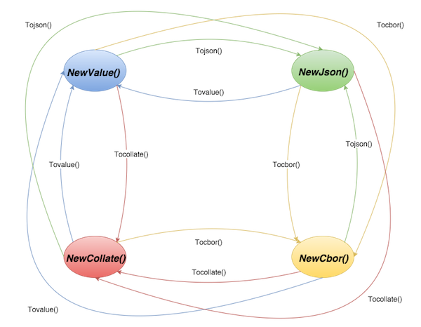

Gson: Data formats
==================

R Pratap Chakravarthy <br/>
prataprc@gmail.com <br/>
[https://github.com/prataprc/gson](https://github.com/prataprc/gson) <br/>
24, Jun 2017

---

Goals
=====

* High performance algorithms for data transformation, serialization and
  manipulation.
* Based on well established standards.
* ZERO allocation when transforming from one format to another, except
  for APIs creating golang values from encoded data.
* [JSON](http://json.org) for web.
* [CBOR](http://cbor.io) for machine.
* [Binary-Collation](https://github.com/prataprc/gson/blob/master/docs/collate.md)
  for crazy fast comparison/sorting.
* [JSON-pointer](https://tools.ietf.org/html/rfc6901) for field lookup within
  document.

---

Data Transformation
===================

* Language, Golang, native values are convenient for programming.
* Binary representation, like CBOR, is convenient for Machine.
  - can avoid parsing data before every computation.
* Collation format, crazy fast memcmp() on complex data shape.
* JSON for web / human interface.

---

Transformations are orthogonal
==============================

Convert from any format to any other format, without loss of information.



---

Data serialization
==================

**CBOR** is suggested for network serialization when nodes belong
to the same cluster, especially when consumer of that data is
another machine.

**JSON** is suggested when data is serialized for web consumption
or when the consumer of that data is a Human.

During development JSON can be used for ease of debugging, and for
production CBOR can be used. Note that data from one format can
be seamlessly transformed to another format.

---

Document lookup and manipulation
================================

To lookup a field within a document and to perform expression
evaluation on the field, we recommend
[JSON-pointer](https://tools.ietf.org/html/rfc6901).

We aim to support ZERO allocation for field lookup and if
it makes sense we can add expression evaluation as part
of lookup.

If document lookup and manipulations are not available in
the expected format, please raise an
[issue](http://github.com/prataprc/gson/issues).

---

<br/>
<br/>
<br/>
<br/>
**All formats are based on RFC standards and Collation format is
precisely defined.**

---

JSON for web
============

JSON is a good trade-off between:

* Human readability.
* Representation of complex data.
* Parsing to machine value, which becomes unavoidable at some point.

Example:

```json
{
  "firstName": "John",
  "lastName": "Smith",
  "age": 25,
  "city": "New York",
  "state": "NY",
  "phoneNumber": "212 555-1234",
}
```

---

CBOR for machine
================

* Fast data serialization / de-serialization
* CBOR o/p can be compact when compared to JSON; due to variable
  length encoding.
* Extensible encoding, that can support future value types.
* Better fit for in-place evaluation, since values are
  stored in machine native formats.
* JSON specification is not precise about Number. CBOR can encode
  int64, uint64 even Big-numbers.

---

CBOR Vs JSON benchmarks
=======================

```bash
BenchmarkVal2CborBool  10000000    158 ns/op    0 B/op   0 allocs/op
BenchmarkVal2CborFlt64  5000000    382 ns/op    0 B/op   0 allocs/op
BenchmarkCbor2ValBool   5000000    303 ns/op    1 B/op   1 allocs/op
BenchmarkCbor2ValFlt64  3000000    515 ns/op    8 B/op   1 allocs/op

BenchmarkJson2ValBool   5000000    291 ns/op    1 B/op   1 allocs/op
BenchmarkJson2ValNum    3000000    524 ns/op    8 B/op   1 allocs/op
BenchmarkVal2JsonBool  10000000    210 ns/op    0 B/op   0 allocs/op
BenchmarkVal2JsonNum   1000000    1736 ns/op    0 B/op   0 allocs/op
```

We get improvements between  2x to 4x. Note that if encoding/json
is used, instead of gson.Json, degradation will be > 4x.

---

Binary-Collation crazy fast comparison
======================================

Let us say a composite key looks like `["paris", 35]`, which is basically
an index on {city,age}, the collated output shall look like -
`"\x12\x10paris\x00\x00\x0f>>235-\x00\x00"`

```bash
# sorting a list of 10000 JSON entires for different shapes
# repeat 100 times
41.10s user 0.84s system 112% cpu 37.265 total
# sorting the same after collation encoding (using memcmp)
# repeat 100 times
2.93s user 0.09s system 115% cpu 2.622 total
```

**An order of magnitude faster, 10x**

---

Ease of use
===========

Always start with the config object. Apply desired configuration,
note that config objects are immutable so make sure to receive a new
config object from each config API.

```go
config := NewDefaultConfig()
config = config.SetNumberKind(FloatNumber).SetContainerEncoding(Stream)
```

---

Format factories
================

Use the config object to create any number of buffer types: JSON,
CBOR, Value, Collate. Reuse the objects, avoid GC pressure.
**buffer objects are not thread-safe**

```go
val := config.NewValue("any golang value")      // *gson.Value
jsn := config.NewCbor(json_byteslice, -1)       // *gson.Json
cbr := config.NewCbor(cbor_byteslice, -1)       // *gson.Cbor
clt := config.NewCbor(collated_byteslice, -1)   // *gson.Collate
...
jsn.Reset(nil)
cbr.Reset(nil)
clt.Reset(nil)
```

---

Transform examples
==================

An example transformation from one data format to another, using
the config object and buffer types.

```go
val := config.NewValue(jsn.Tovalue()) // json -> value
cbr = jsn.Tocbor(cbr)                 // json -> cbor
clt = jsn.Tocollate(collate)          // json -> collate

// json -> collate -> cbor -> value
val := config.NewValue(jsn.Tocollate(cbr).Tocbor(clt).Tovalue())
// To get the underlying data from each buffer:
jsn.Bytes()
cbr.Bytes()
clt.Bytes()
```

---

Thank you
=========

If gson sounds useful please check out the following links.

[Project README](https://github.com/prataprc/gson). <br/>
[Gson API doc](https://godoc.org/github.com/prataprc/gson). <br/>
[Please contribute](https://github.com/prataprc/gson/issues). <br/>
